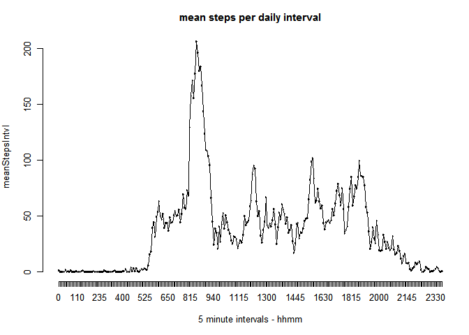

# Reproducible Research: Peer Assessment 1
This Peer Assessment involves analyzing data collected using hip-mounted Samsung mobile phones, taking readings of steps taken by a single subject for each five (5) minute interval over a two month period (61 days).

### Loading and preprocessing the data
The RepData PeerAssessment1 repo was manually forked on Github and cloned locally from https://github.com/rdpeng/RepData_PeerAssessment1. This repo incuded "activity.zip", which file is assumed to be in the working directory.

The activity.zip file is read, unzipped, and stored as a data.table, and keyed for ease and speed in processing. (The libraries make quite a lot of noise as they are loaded and I haven't found a way yet to turn off the warning messages in this document.  They really don't add to this document.)

```r
library(stats)
library(plyr)
library(data.table)
library(dplyr)
```

```
## 
## Attaching package: 'dplyr'
## 
## The following object is masked from 'package:data.table':
## 
##     last
## 
## The following objects are masked from 'package:plyr':
## 
##     arrange, desc, failwith, id, mutate, summarise, summarize
## 
## The following objects are masked from 'package:stats':
## 
##     filter, lag
## 
## The following objects are masked from 'package:base':
## 
##     intersect, setdiff, setequal, union
```

```r
humActData <- data.table(read.csv(unz("activity.zip", "activity.csv"),
                            colClasses = c("date" = "POSIXct", 
                                            "steps" = "integer")))

humActData <- mutate(humActData, dateFac = as.factor(date),
                                intvlFac = as.factor(interval),
                                avail = complete.cases(humActData))
setkey(humActData, dateFac, intvlFac, avail)
```


### Mean total number of steps taken per day
The activity data is summed by day to determine "total number of steps taken each day" and a histogram of that data is plotted.

```r
dayInfo <- humActData[avail == TRUE, sum(steps), by = dateFac]
setnames(dayInfo, 2, "stepsDay")
par(mar = c(5,4,3,1), 
    mfrow = c(1,1),
    cex = 0.8)
hist(dayInfo$stepsDay,22, main = "steps/day ignore NA")
```

 
The mean and median of the steps taken each day are calculated and show that this individual averages about 10K steps per day with the median very close to the mean. On two days, his activity was more than double the mean at as much as 22K steps per day.


```r
dayMeanNoNA <- mean(dayInfo$stepsDay)
dayMeanNoNA
```

```
## [1] 10766
```

```r
dayMedNoNA <- median(dayInfo$stepsDay)
dayMedNoNA
```

```
## [1] 10765
```


### Average daily activity pattern
This individual is most active during the time period between 8:25 to 9:15AM, with 8:35AM being the most active interval at over 206 steps on average.


```r
intvlInfo <- humActData[avail == TRUE, mean(steps), by=intvlFac]
setnames(intvlInfo, 2, "meanStepsIntvl")
par(mar = c(5,4,3,1), 
    mfrow = c(1,1),
    cex = 0.8,
    bty = "n")
plot(intvlInfo, 
     main = "mean steps per daily interval", 
     xlab = "5 minute intervals - hhmm")
lines(intvlInfo)
```

 

```r
maxIntvl <- intvlInfo[which.max(intvlInfo$meanStepsIntvl),]
maxIntvl
```

```
##    intvlFac meanStepsIntvl
## 1:      835          206.2
```
### Imputing missing values
The activity.zip data set has a large number of missing observations. Analysis was done to determine the extent of the missing data.


```r
totDays <- length(table(humActData$dateFac))
totIntvlDay <- 24*(60/5)
totIntvlFile <- length(humActData$dateFac)
missingValues <- sum(!humActData$avail)
missingValues
```

```
## [1] 2304
```

```r
missingDays <- totDays - (length(dayInfo$dateFac))
missingDays
```

```
## [1] 8
```

```r
totIntvlFile == totDays * totIntvlDay
```

```
## [1] TRUE
```
The data is missing over 2300 observatons and, in fact, has no observations at all for 8 days. Before trying to impute the missing observations, a check is made to ensure that all intervals for every day are represented and the response is positive.

Missing observations (NAs) are replaced with the mean of all observations for that interval over all days.

```r
repdIntvlInfo <- intvlInfo$meanStepsIntvl
for (i in 1:(totDays - 1)) {
    repdIntvlInfo <- c(repdIntvlInfo,intvlInfo$meanStepsIntvl)
}

humActDataImpNA <- humActData
humActDataImpNA$steps[is.na(humActDataImpNA$steps)] <- 
    repdIntvlInfo[is.na(humActDataImpNA$steps)]

dayInfoImpNA <- humActDataImpNA[, sum(steps), by=dateFac]
setnames(dayInfoImpNA, 2, "stepsDay")
par(oma = c(3,2,2,1), 
    mar = c(1,1,1,1), 
    mfrow = c(1,2),
    cex = 0.6)

hist(dayInfo$stepsDay, 22, 
     main = "steps/day ignore NA",
     ylim = c(0,18))
hist(dayInfoImpNA$stepsDay,22,
     main = "steps/day impute NA",
     ylim = c(0,18))
```

 
The panel plot compares the data without and with imputed data.  The primary difference is the appearance of the 8 missing days in the new data.  Not surprisngly, since only mean data was imputed for the missing days, it has the effect of adding 8 days at the mean/median.

```r
dayMeanImpNA <- mean(dayInfoImpNA$stepsDay)
dayMeanImpNA
```

```
## [1] 10766
```

```r
dayMedImpNA <- median(dayInfoImpNA$stepsDay)
dayMedImpNA
```

```
## [1] 10766
```
The imputed data has no effect on the mean daily activity and only pulls the median closer to the mean.

### Differences in activity patterns - weekdays vs. weekends
The activity paterns for the subject were compared based on weekday vs. weekend activity. 

- On weekdays, it is interesting to see the somewhat earlier activity occuring in the 6:00AM to 8:15AM time period with the more intense activity period around 9:00AM.

- Weekends show the 9:00AM activity spike to be missing, however there is higher and more uniform activity throughout the day.

```r
humActDataImpNA <- mutate(humActDataImpNA, 
                dayType = factor(grepl("Saturday|Sunday", weekdays(date)),
                                 labels = c("weekday", "weekend")))   
setkey(humActDataImpNA, dateFac, intvlFac, avail, dayType)

dayTypeIntvlInfo <- humActDataImpNA[ , mean(steps), by = c("intvlFac", "dayType")]
setnames(dayTypeIntvlInfo, 3, "meanStepsIntvl")
weekdayIntvlInfo <- filter(dayTypeIntvlInfo, dayType == "weekday")
weekdayIntvlInfo <- select(weekdayIntvlInfo, intvlFac, meanStepsIntvl)
weekendIntvlInfo <- filter(dayTypeIntvlInfo, dayType == "weekend")
weekendIntvlInfo <- select(weekendIntvlInfo, intvlFac, meanStepsIntvl)
par(oma = c(1,1,1,1), 
    mar = c(4,4,2,1), 
    mfrow = c(2,1),
    cex = 0.6,
    bty = "n")
plot(weekdayIntvlInfo, 
     main = "weekday mean steps/intvl", 
     xlab = "",
     ylab = "steps/intvl",
     ylim = c(0,250))
lines(weekdayIntvlInfo)
plot(weekendIntvlInfo, 
     main = "weekend mean steps/intvl", 
     xlab = "intervals (hhmm)",
     ylab = "steps/intvl",
     ylim = c(0,250))
lines(weekendIntvlInfo)
```

 
